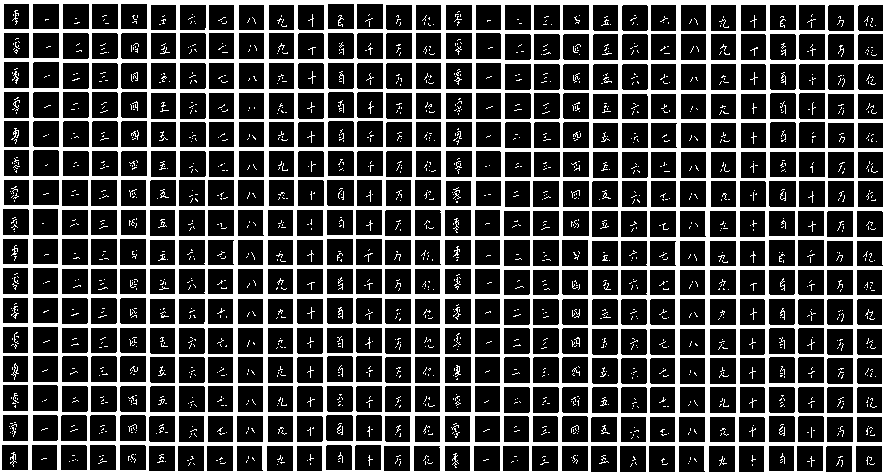

# Chinese Digit Recognizer

Chinese digit recognizer (Chinese MNIST) project for Algoritma Learn by Building: Neural Network

## Introduction

According to [Worldometer](https://www.worldometers.info/world-population/), China is the most populated country in the world. Chinese character (hànzì) has been the basis of other languages, such as Japanese (kanji), Korean (hanja), and Vietnamese (chữ Hán). Nevertheless, not many people other than the Chinese citizen understand Chinese characters, mainly caused by the complexity of the characters. Therefore, in this project let's make a machine learning model that can recognize Chinese character, especially Chinese digits. The data consists of images of handwritten Chinese characters from 0 to 10, 100, 1000, 10000 (ten thousand), and 100000000 (a hundred million).

{width="75%"}

## Datasets

The data we are going to be using are taken from Kaggle; the [Chinese Digit Recognizer](https://www.kaggle.com/datasets/fedesoriano/chinese-mnist-digit-recognizer "Chinese MNIST in CSV - Digit Recognizer") as the main dataset, and [Chinese MNIST](https://www.kaggle.com/datasets/gpreda/chinese-mnist "Chinese MNIST") as the indexing dataset containing labels.

## Libraries

In this project, we will be using `keras` library to make our machine learning model and `caret` to split the data and make a confusion matrix.

    library(keras)
    library(dplyr)
    library(caret)

## Navigation

-   Published article: <https://rpubs.com/divakartika/chinese-digit-classifier>

-   Code (rmarkdown): `chinese_mnist.Rmd`

-   Cleaned dataset: `data-input/chinese_mnist.RDS`

-   Neural network models:

    -   DNN: `data-output/model1.h5`

    -   CNN: `data-output/model2.h5`

## Conclusion

Due to the complexity, Chinese characters are not easy to learn. Yet, in this project, we have successfully made our machine learn from images of handwritten Chinese digits with Deep Neural Network and Convolutional Neural Network. With ordinary DNN (using only dense layers), we've achieved a test accuracy of around 78%, while with CNN, we've achieved 90% test accuracy. This shows that CNN improves model training from image data, as stated by the references mentioned above. Further application of CNN for image data is image recognition. Digit and letter recognition, for example, can be developed into language translation from an image.
