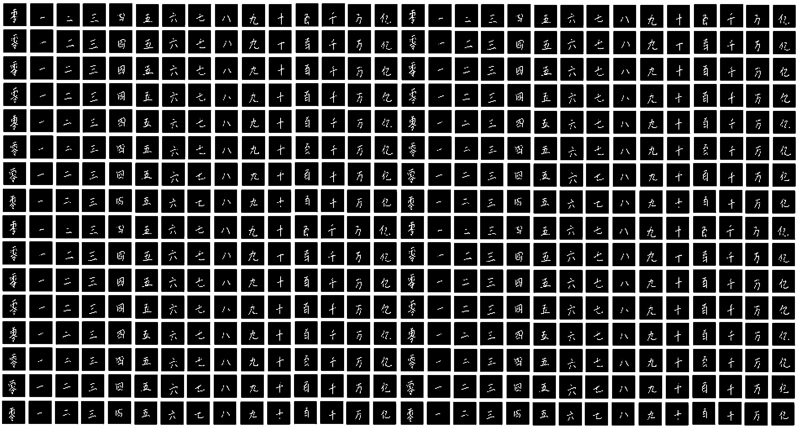

```{r setup, include=FALSE}
# clear-up the environment
rm(list = ls())

# chunk options
knitr::opts_chunk$set(
  message = FALSE,
  warning = FALSE,
  fig.align = "center"
)

options(scipen = 9999)
```

 on [Unsplash](https://unsplash.com/s/photos/shanghai?utm_source=unsplash&utm_medium=referral&utm_content=creditCopyText)](images/nuno-alberto-MykFFC5zolE-unsplash.jpg)

# Introduction

According to [Worldometer](https://www.worldometers.info/world-population/), China is the most populated country in the world. Chinese character (hànzì) has been the basis of other languages, such as Japanese (kanji), Korean (hanja), and Vietnamese (chữ Hán). Nevertheless, not many people other than the Chinese citizen understand Chinese characters, mainly caused by the complexity of the characters. Therefore, in this project let's make a machine learning model that can recognize Chinese character, especially Chinese digits. The data consists of images of handwritten Chinese characters from 0 to 10, 100, 1000, 10000 (ten thousand), and 100000000 (a hundred million).

{width="75%"} {width="22%"}

## Image Data

A digital image consists of pixels or picture elements. According to [Cambridge Dictionary](https://dictionary.cambridge.org/dictionary/english/pixel), pixel is the smallest unit of an image in a digital platform. Each pixel contains a value, called pixel value. A pixel value ranges between 0 to 255 describing its brightness (for grayscale images) or its color strength (for colored images).

```{r echo=FALSE, out.width="60%"}
knitr::include_graphics("https://ai.stanford.edu/~syyeung/cvweb/Pictures1/imagematrix.png")
```

The size of an image relies heavily on the number of pixels it has. For example, if you have an image with the size $1000 \times 1500$, it means that your image has the width of 1000 pixels and height of 1500 pixels. The total number of pixels in that image is $1000 \times 1500 = 1500000$ (a million and a half) pixels.

```{r echo=FALSE, out.width="60%" }
knitr::include_graphics("https://d33v4339jhl8k0.cloudfront.net/docs/assets/5b3655190428630abc0b8ffc/images/5fd083c112909d16116e0174/file-whr7Lb2M5Q.png")
```

# Prerequisites

## Import Library

Let's import the required libraries. In this project, we will be using `keras` library to make our machine learning model and `caret` to split the data and make a confusion matrix.

```{r}
library(keras)
library(dplyr)
library(caret)
```

## Load the Datasets

The data we are going to be using are taken from Kaggle; the [Chinese Digit Recognizer](https://www.kaggle.com/datasets/fedesoriano/chinese-mnist-digit-recognizer "Chinese MNIST in CSV - Digit Recognizer") as the main dataset, and [Chinese MNIST](https://www.kaggle.com/datasets/gpreda/chinese-mnist "Chinese MNIST") as the indexing dataset containing labels.

```{r}
chinese_mnist <- read.csv("data-input/chineseMNIST.csv") # main dataset
chinese_meta <- read.csv("data-input/chinese_mnist.csv") # index (contains labels)

# combine the metadata to the main dataset
chinese_mnist$label <- chinese_meta$code
chinese_mnist$value <- chinese_meta$value

# rearrange the dataset so "label", "value", and "character" are the first two columns
chinese_mnist <- chinese_mnist %>%
  select(label, value, character, everything())
```

# Exploratory Data Analysis {.tabset}

## Data Inspection

Let's inspect the training data by using the `head()` function

```{r}
head(chinese_mnist)
```

Explanation:

-   `label` = numerical code for target variable

-   `value` = the actual value of each character

-   `character` = Chinese number character in unicode

-   `pixel_0`, ..., `pixel_4096` = predictors, in pixel value

## Check Missing Value

Let's check if we have missing values in our dataset.

```{r}
sum(is.na(chinese_mnist))
```

We have no missing values, sweet!

## Check Class Imbalance

Now let's check the number of data we have for each character.

```{r}
table(chinese_mnist$character)
```

The result above shows that there are no class imbalance, great!

## Check Data Size

Next, let's count the number of predictors that we have.

```{r}
dim(chinese_mnist[-c(1:3)])
```

The number `15000` shows that we have 15000 entries in our dataset, while `4096` shows that we have 4096 columns, representing the number of pixels in a picture a.k.a in an entry. Each of our data is a square picture with $64\times64$ pixels, and $64\times64=4096$ (you can prove it by yourself!)

## Data Visualization

Let's take a peek at the first 36 entries of our training dataset using `vizTrain`, a function made by Samuel Chan!

```{r}
vizTrain <- function(input){
  
  dimmax <- sqrt(ncol(input[,-c(1:3)]))
  
  dimn <- ceiling(sqrt(nrow(input)))
  par(mfrow=c(dimn, dimn), mar=c(.1, .1, .1, .1))
  
  for (i in 1:nrow(input)){
      m1 <- as.matrix(input[i,4:4099])
      dim(m1) <- c(64,64)
      
      m1 <- apply(apply(m1, 1, rev), 1, t)
      
      image(1:64, 1:64, 
            m1, col=grey.colors(255), 
            # remove axis text
            xaxt = 'n', yaxt = 'n')
      text(25, 10, col="white", cex=1.2, input[i, 2])
  }
  
}

vizTrain(sample_n(chinese_mnist, 36))
```

# Data Preprocessing

Let's take a look at the unique values from the `label` column.

```{r}
sort(unique(chinese_mnist$label))
```

We can see that the labels start from 1, this can cause dimensional mismatch error since we are using Keras, a library built for Python (Python numbering starts from 0). To avoid that error, let's rearrange the label so it starts from 0.

```{r}
chinese_mnist <- chinese_mnist %>%
  mutate(label = ifelse(label > 0, label-1, label))

sort(unique(chinese_mnist$label))
```

## Split Dataset

To validate the performance of our dataset, let's split our dataset into training, validation, and testing data. This way, we can see the performance of our machine learning model when dealing with unseen data. We would split the data into 80% training, 10% validation, and 10% testing datasets.

```{r}
set.seed(100)
train_index <- createDataPartition(as.factor(chinese_mnist$label), p = 0.8, list = FALSE)
data_train <- chinese_mnist[ train_index,]
data_test  <- chinese_mnist[-train_index,]

set.seed(100)
test_index <- createDataPartition(as.factor(data_test$label), p = 0.5, list = FALSE)
data_val   <- data_test[ test_index,]
data_test  <- data_test[-test_index,]
```

## Scaling and Data Separation

Remember the theory about pixels mentioned at the beginning? It is exhaustive for our computer to calculate values ranging from 0 to 255, so it is wise to **scale** the data to range from 0 to 1. This is called **min-max scaling**. This can be done by **dividing the values in our data by the maximum value**, in this case 255.

To ease further data processing, let's separate the predictors and labels and put them into new variables.

```{r}
data_train_x <- data_train %>% 
  select(-c(label,character,value)) %>% # take only the predictors
  as.matrix()/255 # change the data type into matrix and do min-max scaling

data_train_y <- data_train$label # take only the labels

data_val_x <- data_val %>% 
  select(-c(label,character,value)) %>% 
  as.matrix()/255

data_val_y <- data_val$label

data_test_x <- data_test %>% 
  select(-c(label,character,value)) %>% 
  as.matrix()/255

data_test_y <- data_test$label
```

## Change the Data Type

Keras only accept predictors in the form of array, and labels in the form of one-hot-encoded categories. One-hot encoding means that we are giving a "binary" code for each class.

```{r echo=FALSE, out.width="70%" }
knitr::include_graphics("https://miro.medium.com/max/1400/1*O_pTwOZZLYZabRjw3Ga21A.png")
```

Let's change our predictors into arrays and do one-hot encoding for our labels.

```{r}
# Change predictors to arrays
train_x <- array_reshape(data_train_x, dim=dim(data_train_x))
val_x <- array_reshape(data_val_x, dim=dim(data_val_x))
test_x <- array_reshape(data_test_x, dim=dim(data_test_x))

# One-hot encoding target variable
train_y <- to_categorical(data_train_y)
val_y <- to_categorical(data_val_y)
test_y <- to_categorical(data_test_y)
```

# The ML Model

In this project, we are going to use a Deep Neural Network (DNN). According to [IBM](https://www.ibm.com/cloud/learn/neural-networks#toc-neural-net-u3voPJVU), DNN is a neural network with more than three layers, including the input and output layers.

```{r echo=FALSE, out.width="50%" }
knitr::include_graphics("https://1.cms.s81c.com/sites/default/files/2021-01-06/ICLH_Diagram_Batch_01_03-DeepNeuralNetwork-WHITEBG.png")
```

To build a DNN with Keras, there are two major steps that we should do.

1.  Make a sequential model\
    To make a sequential model, we can use the function `keras_model_sequential()`

2.  Make the neural network layers\
    The most basic layer type is the dense layer. We can make a dense layer using `layer_dense()` function. This function has several parameters:

    -   `input_shape` : the shape of our predictors, only used for the **first hidden layer**

    -   `units` : the number of neurons in a layer

    -   `activation` : the activation function used for a layer

    -   `name` : (optional) the name of a layer

    **Note**: for the last layer (output layer), `units` has to be the same as the amount of target variables.

## Take the Data Sizes

To ease our value assignment for parameters in building the deep learning model, let's put our data size values into new variables.

```{r}
input_dim <- ncol(train_x) # dimension of predictors
num_class <- n_distinct(data_train$label)
```

## Build the DNN Architecture

Let's try to build a Deep Neural Network (DNN) with only two hidden layers, with 64 and 32 neurons/nodes for the first and second hidden layers consecutively. Since we want the data to be processed non-negatively, let's use ReLU activation function for the hidden layers, and Softmax for the output layer since we are dealing with multiclass classification case.

```{r}
model1 <- keras_model_sequential() %>% 
  
  # input layer + first hidden layer
  layer_dense(input_shape = input_dim, # dimension of predictors
              units = 64, # number of neurons/nodes
              activation = "relu", # activation function
              name = "hidden_1") %>%
  
  # Dense layer
  layer_dense(units = 32,
              activation = "relu") %>% # to produce non-negative values
  
  # output layer
  layer_dense(units = num_class, # num. of target classes
              activation = "softmax", # for multiclass classification case
              name = "ouput")
```

## Compile the Model

Since we are working with a multiclass classification case, we will use categorical cross-entropy as our loss function. Let's try using Adam optimizer since it's one of the most used optimizer. According to Jason Brownlee, PhD., the founder of [Machine Learning Mastery](https://machinelearningmastery.com/adam-optimization-algorithm-for-deep-learning/),

> The Adam optimization algorithm is an extension to stochastic gradient descent that has recently seen broader adoption for deep learning applications in computer vision and natural language processing.

If you are interested, you can read more about Adam optimizer straight from its [inventors](https://arxiv.org/abs/1412.6980).

```{r}
model1 %>% 
  compile(loss = loss_categorical_crossentropy(),
          optimizer = optimizer_adam(learning_rate = 0.01),
          metrics = "accuracy")
```

## Fit the Model

Time for the model to learn! Let's use the `fit()` function and pass `epoch=15` to make our machine iterate its learning process 15 times and evaluate the result after every 1000 data entries with `batch_size=1000`. To see the accuracy on unseen data, don't forget to pass our validation datasets into the `validation_data` parameter.

```{r}
history <- model1 %>% 
  fit(x = train_x,
      y = train_y,
      epoch = 15,
      validation_data = list(val_x, val_y),
      batch_size = 1000)

plot(history)
```

## Predict the Test Data

Now let's predict the result of our testing dataset using the `predict()` function.

```{r}
pred <- predict(model1, test_x) %>% 
  k_argmax() %>% # take the highest probability value
  as.array() %>%
  as.factor()
```

## Evaluate the Model

Last step: evaluation! We can use the `confusionMatrix` function from `caret` library to produce a confusion matrix and accuracy value.

```{r}
confusionMatrix(data=pred, reference = as.factor(data_test$label),)
```

Seems like the accuracy is still quite low. Let's improve our model by using **convolutional layer** in our Deep Neural Network.

# Convolutional Neural Network

Convolutional Neural Network (CNN) is a type of neural network that uses convolution layer. CNN is highly popular to be used for image data, as stated by [IBM](https://www.ibm.com/cloud/learn/convolutional-neural-networks),

> Convolutional neural networks are distinguished from other neural networks by their superior performance with image, speech, or audio signal inputs.

A CNN typically consists of these layers.

1.  Convolutional layer\
    A convolution layer works by implementing a filter towards the image. It works by multiplying the pixel values in the image matrix with the values in the filter matrix. The filter then shifts until all pixel values are multiplied.

    ```{r, out.width="60%", echo=FALSE}
    knitr::include_graphics("https://1.cms.s81c.com/sites/default/files/2021-01-06/ICLH_Diagram_Batch_02_17A-ConvolutionalNeuralNetworks-WHITEBG.png")
    ```

    Here is an animated version of how convolutional layer works.

    ```{r, out.width="60%", echo=FALSE}
    knitr::include_graphics("https://madewithml.com/static/images/foundations/cnn/convolution.gif")
    ```

    A convolution layer essentially extract features from your image, like horizontal lines, vertical lines, edges, etc. Our machine learn these features in the training process, and try to identify these patterns when given unseen data.

    ```{r, out.width="60%", echo=FALSE}
    knitr::include_graphics("https://www.cs.toronto.edu/~lczhang/360/lec/w04/imgs/sobel1.png")
    ```

2.  Pooling layer\
    Pooling layer is used to decrease computational effort without losing important information. Pooling layer works similarly to convolutional layer, except that the filter pooling layer does not implement multiplication. Instead, it applies an aggregation function to the captured matrix. There are two types of pooling:

    1.  Max pooling\
        Works by taking the maximum value of the captured matrix

    2.  Average pooling\
        Works by taking the average value of the captured matrix

    ```{r, out.width="60%", echo=FALSE}
    knitr::include_graphics("https://miro.medium.com/max/1400/1*oP-lySI7atBfDgpWQjnB6w.png")
    ```

3.  Flatten layer\
    As the name suggests, flatten layer flattens the data from a matrix to a very long vector so that a dense layer can process it. Layers processing the data after the flatten layer are usually called fully-connected layers.

    ```{r, out.width="60%", echo=FALSE}
    knitr::include_graphics("https://miro.medium.com/max/1400/1*IWUxuBpqn2VuV-7Ubr01ng.png")
    ```

Here is a diagram that shows the how layers mentioned above are connected.

```{r, out.width="60%", echo=FALSE}
knitr::include_graphics("https://miro.medium.com/max/1400/1*6LEgDnjpbEhbvi3RrOuc6g.png")
```

## Data Preprocessing: Change the Dimension

To use convolution layer, we must go back to the step where we change the data type. The cell below looks *almost* identical to the cell in [Change the Data Type] section.

```{r}
# Change predictors to arrays
train_x <- array_reshape(data_train_x, dim=c(dim(data_train_x)[1],64,64,1))
val_x <- array_reshape(data_val_x, dim=c(dim(data_val_x)[1],64,64,1))
test_x <- array_reshape(data_test_x, dim=c(dim(data_test_x)[1],64,64,1))

# One-hot encoding target variable
train_y <- to_categorical(data_train_y)
val_y <- to_categorical(data_val_y)
test_y <- to_categorical(data_test_y)
```

Notice the difference? Correct! This time we need to change the `dim` parameter inside the `array_reshape()` function. You can see the difference better in the raw text chunk below.

    # Without convolution layer
    train_x <- array_reshape(data_train_x, dim=dim(data_train_x))
    val_x <- array_reshape(data_val_x, dim=dim(data_val_x))
    test_x <- array_reshape(data_test_x, dim=dim(data_test_x))

    # With convolution layer
    train_x <- array_reshape(data_train_x, dim=c(dim(data_train_x)[1],64,64,1))
    val_x <- array_reshape(data_val_x, dim=c(dim(data_val_x)[1],64,64,1))
    test_x <- array_reshape(data_test_x, dim=c(dim(data_test_x)[1],64,64,1))

Now what does `c(dim(data_train_x)[1],64,64,1)` mean? Explanation:

-   `dim(data_train_x)` = the number of rows in the `data_train_x` dataset

-   `64,64` = the dimension/size of the image

-   `1` = the number of color channel(s), 1 for BW and 3 for RGB

## Build the CNN Architecture

Let's just redo assigning data sizes into variables.

```{r}
input_dim <- ncol(train_x)
num_class <- n_distinct(data_train$label)
```

To make a convolution layer, we can use the `layer_conv_2d()` function. Don't forget to fill the `input_shape` parameter for the first layer of our network. This time we pass the value `c(64,64,1)` which means our data is a two-dimensional array with the size of $64\times64$ and one channel.

```{r}
model2 <- keras_model_sequential() %>% 
  
  # Convolutional layer
  layer_conv_2d(input_shape = c(64,64,1),
                filters = 16,
                kernel_size = c(3,3), # 3 x 3 filters
                activation = "relu") %>%
  
  # Max pooling layer
  layer_max_pooling_2d(pool_size = c(2,2)) %>%
  
  # Flattening layer
  layer_flatten() %>%
  
  # Dense layer
  layer_dense(units = 32,
              activation = "relu") %>% 
  
  # output layer
  layer_dense(units = num_class,
              activation = "softmax",
              name = "ouput")
```

## Compile and Fit the Model

Let's just make the rest of things the same for the next steps 😃

```{r}
model2 %>% 
  compile(loss = loss_categorical_crossentropy(),
          optimizer = optimizer_adam(learning_rate = 0.01),
          metrics = "accuracy")
```

```{r}
history <- model2 %>% 
  fit(x = train_x,
      y = train_y,
      epoch = 15,
      validation_data = list(val_x, val_y),
      batch_size = 1000,
      )

plot(history)
```

## Prediction & Evaluation

Let's predict our CNN model with the unseen test data.

```{r}
pred <- predict(model2, test_x) %>% 
  k_argmax() %>%
  as.array() %>% 
  as.factor()
```

```{r}
confusionMatrix(data=pred, reference = as.factor(data_test$label))
```

Fantastic, the accuracy of our model just went 12% higher!

# Conclusion

Due to the complexity, Chinese characters are not easy to learn. Yet, in this project, we have successfully made our machine learn from images of handwritten Chinese digits with Deep Neural Network and Convolutional Neural Network. With ordinary DNN (using only dense layers), we've achieved a test accuracy of around 78%, while with CNN, we've achieved 90% test accuracy. This shows that CNN improves model training from image data, as stated by the references mentioned above. Further application of CNN for image data is image recognition. Digit and letter recognition, for example, can be developed into language translation from an image.

# References

1.  <https://www.ibm.com/cloud/learn/neural-networks>
2.  <https://www.ibm.com/cloud/learn/convolutional-neural-networks>
3.  <https://www.cs.toronto.edu/~lczhang/360/lec/w04/convnet.html>
4.  <https://machinelearningmastery.com/adam-optimization-algorithm-for-deep-learning/>
